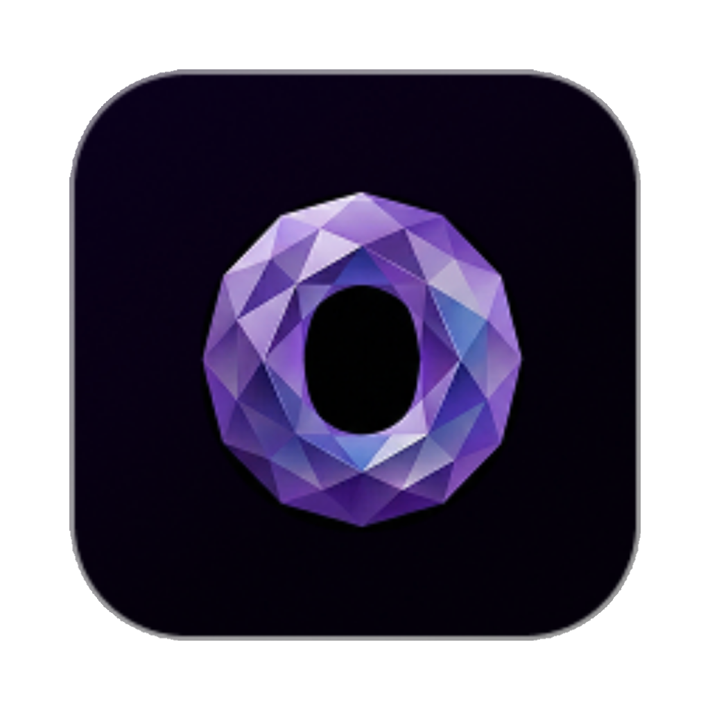

<div align="center">



# Orkestral

### The AI-assisted development operational deck

**Hire a team of AI agents that plan, track, execute and review your code — all in one local-first desktop app.**

[](#)
[](#)
[](#)
[](https://github.com/Orkestral-AI/orkestral/releases/latest)
[](LICENSE)

🇧🇷 **[Versão em Português](README.pt-BR.md)**

</div>

---

## What is Orkestral?

Orkestral is a desktop app where a **team of AI agents works on your codebase with full context**. Instead of pasting snippets into a chat window, you give Orkestral your repositories and let an orchestrator (the **CEO** agent) coordinate specialists — Tech Lead, Code Reviewer, Frontend, Backend, DevOps, and more — to turn requests into **trackable work**: issues, code changes, reviews, and a living knowledge base.

Everything runs **on your machine**. Your code, conversations, agents and data stay local (`~/.orkestral`) — no server required, free to use.

> **The core idea:** premium models _plan_, a local model (**Forge**) _executes_ at $0 per task, and you stay in control. Chat, issues, git, code review and knowledge are unified into one operational deck so nothing gets lost between tools.

---

## What it does

|                                |                                                                                                                                                                                                                                                                                            |
| ------------------------------ | ------------------------------------------------------------------------------------------------------------------------------------------------------------------------------------------------------------------------------------------------------------------------------------------ |
| 💬 **Chat with agents**        | Talk to your CEO agent in natural language. It reads the project, identifies the stack, and coordinates work. Mention `@agent` to route to a specialist.                                                                                                                                   |
| 🧩 **Issues & epics**          | Requests become trackable issues, auto-grouped under epics, with status, priority, assignee, parent/child links — and server-side dedup so you don't get duplicates.                                                                                                                       |
| 🤖 **A team of agents**        | The CEO can propose and "hire" an initial team (Tech Lead + Code Reviewer + specialists) with a proper reporting hierarchy.                                                                                                                                                                |
| ⚙️ **Local execution (Forge)** | A local code model executes code patches deterministically — **$0 API cost**. Downloaded on demand (not bundled), it only escalates to a premium model when needed. It learns _how_ developers handle code — **never your code** — and auto-updates to smarter versions trained centrally. |
| 🔍 **Code reviews**            | Senior-level PR reviews on your GitHub pull requests, with structured findings and inline comments.                                                                                                                                                                                        |
| 🧠 **Knowledge base**          | A wiki-style brain for each workspace: pages, wikilinks, and a graph view. Auto-generated from your repos via **lexical (BM25) + local semantic search** (embeddings/RAG) — all on-device, no cloud.                                                                                       |
| 🔁 **Routines & goals**        | Recurring automations and workspace goals the agents can act on.                                                                                                                                                                                                                           |
| 🔌 **MCP & integrations**      | Connect Model Context Protocol servers (e.g. Playwright browser tools) and multiple agent providers.                                                                                                                                                                                       |
| 🌎 **Multilingual**            | Full English + Brazilian Portuguese UI, auto-detected from your OS. Agents reply in the language you write in.                                                                                                                                                                             |

---

## How it works

### The agent model

```
            ┌─────────────────────────────────────────────┐
            │                  YOU                         │
            └───────────────────┬─────────────────────────┘
                                │ natural language
                                ▼
                       ┌─────────────────┐
                       │   CEO / Orchestr.│  reads repo, plans, delegates
                       └────────┬────────┘
              ┌─────────────────┼──────────────────┐
              ▼                 ▼                   ▼
        ┌──────────┐     ┌─────────────┐     ┌───────────┐
        │ Tech Lead│     │Code Reviewer│     │Specialists│  Frontend,
        └────┬─────┘     └─────────────┘     └───────────┘  Backend, DevOps…
             │ coordinates specialists
             ▼
   Issues · Code changes · Reviews · Knowledge base
```

The CEO reports to you; Tech Lead and Code Reviewer report to the CEO; specialists report to the Tech Lead. Every meaningful request becomes **issues** — the product is trackable work, not throwaway prose.

### Premium plans, local executes (Orkestral Forge)

**Forge** is Orkestral's local code model (Qwen2.5-Coder via `node-llama-cpp`, GGUF) that runs entirely offline at **$0 per task**. It is **not bundled** in the installer — it downloads on demand (from Orkestral's CDN) the first time the CEO proposes an agent that uses it, with a one-click prompt. Until it's downloaded, those agents fall back to a premium model. The execution pipeline minimizes API cost without sacrificing correctness:

```
 premium model ──► PLAN the change (what files, what edits)
        │
        ▼
 Forge (local)  ──► EXECUTE: emit SEARCH/REPLACE edit blocks
        │
        ▼
 Morph applier  ──► deterministically apply edits (exact → fuzzy, never wrong)
        │
        ├─ success ──► done, $0 API cost
        └─ can't apply ──► escalate to premium model (once) as fallback
```

**Morph** is a deterministic SEARCH/REPLACE engine: it applies edits via exact match, then whitespace-normalized, then a safe single-match fuzzy pass — and **rejects** anything ambiguous rather than writing the wrong content. A cost dashboard shows how many runs were resolved locally vs. escalated.

### Forge learns over time (trained centrally, runs locally)

Forge isn't frozen. It gets smarter from how developers actually work — while **your code never leaves your machine**:

```
 your machine: premium PLANS → Forge EXECUTES → review VERIFIES
        │  (a code-free signal: which approach won, what was corrected)
        ▼
 Orkestral cloud ──► trains a smarter Forge from the signals (central GPU)
        │
        ▼
 new Forge version ──► your local Forge auto-updates to it
```

- **The privacy barrier is the whole point:** the cloud learns **how you deal with code** — which approaches win, what gets corrected — **never your code**, which never leaves your machine. Only small, code-free signals are sent (and only while you're signed in to Orkestral Cloud).
- **Runs on your machine:** every task still executes locally at $0. The central training only ships a better set of weights; inference never goes to the cloud.
- **One model, replaced in place:** there's a single current Forge that auto-updates — no version sprawl on your disk.

> The signal pipeline ships today; the central training that turns those signals into a smarter Forge is rolling out next.

### Unified context

Chat, issues, git status/diffs, code reviews and the knowledge base all live in the same workspace and feed each other. The agents read across them, so a conversation can spawn issues, an issue can run an agent, and learnings get written back to the KB.

---

## Tech stack

- **Shell:** Electron 39 + [electron-vite](https://electron-vite.org)
- **UI:** React 19, React Router 7, Tailwind CSS v4, Radix UI, Framer Motion, Lucide
- **State/data:** Zustand, TanStack Query
- **Database:** better-sqlite3 + Drizzle ORM (local SQLite in `~/.orkestral`)
- **Local models:** node-llama-cpp (GGUF) — **Forge** (Qwen2.5-Coder) and **embeddings** (Qwen3-Embedding) both downloaded on demand from Orkestral's CDN (no model weights in the installer, so it stays small); Forge auto-updates to centrally-trained versions
- **Editor/KB:** BlockNote, BM25 lexical + embedding search (`.bkf` snapshots)
- **Packaging:** electron-builder + electron-updater (auto-update on Windows/Linux)

---

## Getting started

### Prerequisites

- **Node.js 20+** and npm
- For premium adapters: the **Claude Code** (`claude`) and/or **Codex** (`codex`) CLIs installed and authenticated. Forge (local execution) needs nothing extra — it downloads on demand the first time an agent uses it.

### Run in development

```bash
npm install
npm run dev
```

The embeddings model downloads on demand the first time it's used (`setup:models` can pre-fetch it for dev).

### Build installers

| Command              | Output                                |
| -------------------- | ------------------------------------- |
| `npm run dist:mac`   | macOS `.dmg` + `.zip` (Apple Silicon) |
| `npm run dist:win`   | Windows `.exe` (NSIS)                 |
| `npm run dist:linux` | Linux `.AppImage`                     |
| `npm run dist:all`   | all three (needs native runners)      |

Output lands in `dist/`. The installers ship **no model weights**, so each one is small (~150–250 MB); **Forge and the embeddings model download on demand** from Orkestral's CDN the first time they're used. The app runs offline once a model is in place.

**Releases** are produced by CI: pushing a `v*` tag (or running the **Release** workflow manually) builds all three platforms on native GitHub runners and publishes the installers to a GitHub Release. See [`docs/RELEASING.md`](docs/RELEASING.md).

> Builds are **not code-signed yet** — the OS shows a warning on first launch (macOS Gatekeeper / Windows SmartScreen). It's safe; just confirm the install. Code signing + notarization is on the roadmap.

### Useful scripts

| Script              | What it does                                              |
| ------------------- | --------------------------------------------------------- |
| `npm run dev`       | Dev with HMR (renderer only; main/preload need a restart) |
| `npm run build`     | Type-check (node + web) + production build                |
| `npm run typecheck` | TypeScript only                                           |
| `npm run dist:mac`  | Build the macOS `.dmg` + `.zip`                           |

---

## Project structure

```
src/
├─ main/            Electron main process
│  ├─ adapters/     Agent providers (claude, codex, forge, gemini, cursor…)
│  ├─ db/           Drizzle schema, migrations, repositories
│  ├─ ipc/          Typed IPC handlers
│  ├─ services/     chat, issues, code review, KB, smart-exec (Forge)…
│  └─ i18n.ts       Server-side language resolution
├─ preload/         Secure bridge (auto-exposes window.orkestral)
├─ renderer/        React app
│  └─ src/
│     ├─ pages/         Issues, Inbox, Dashboard, Knowledge, Agents…
│     ├─ components/    chat, onboarding, settings, layout…
│     └─ i18n/          UI translations (en / pt-BR, one file per area)
└─ shared/          Types + the typed IPC contract
```

---

## Privacy & data

Orkestral is **local-first**. Everything is stored on your machine under `~/.orkestral` (SQLite database, workspace files, the local model). No telemetry is collected or sent. You can export your data to JSON or clear it from **Settings → Data**.

---

## Roadmap

- ✅ Local-first single-user (free) — chat, issues, agents, code review, KB, Forge local execution + local embeddings
- ✅ English + Brazilian Portuguese, OS-aware
- ✅ **macOS · Windows · Linux** installers, CI releases, and in-app auto-update (Windows/Linux)
- 🔜 **Orkestral Cloud** — team plan: accounts, shared workspaces, device sync, managed backups _(in progress at [orkestral.pro](https://orkestral.pro))_
- 🔜 **Forge central training** — turning the code-free signals into smarter Forge versions on a central GPU, auto-shipped to every install (never their code). The signal pipeline ships now; the training is rolling out.
- 🔜 Code signing + notarization (remove the first-launch OS warning)
- 🔜 Richer retrieval, broader provider integrations

---

## Contributing

Contributions are welcome — bug fixes, features, translations, docs.

- Read **[CONTRIBUTING.md](CONTRIBUTING.md)** for the dev setup (`npm install` → `npm run setup:models` → `npm run dev`) and the quality gate to run before a PR (`npm run typecheck && npm run lint && npm run format && npm run test`).
- Found a bug or have an idea? Open an [issue](https://github.com/Orkestral-AI/orkestral/issues).
- We follow the [Contributor Covenant Code of Conduct](CODE_OF_CONDUCT.md).

## Community & support

- 🐛 **Issues** — [github.com/Orkestral-AI/orkestral/issues](https://github.com/Orkestral-AI/orkestral/issues)
- 🌐 **Website** — [orkestral.pro](https://orkestral.pro)
- 🔒 **Security** — please report vulnerabilities **privately** (see [SECURITY.md](SECURITY.md)).

## License

Orkestral is released under the **[Functional Source License — FSL-1.1-Apache-2.0](LICENSE)**: free to use, modify and self-host, with one restriction — you may **not** use it to build a competing commercial product or service. Two years after each release, that version automatically converts to **Apache 2.0**. See [LICENSE](LICENSE) for the full terms.

---

<div align="center">

🇧🇷 [Leia em Português](README.pt-BR.md)

</div>
